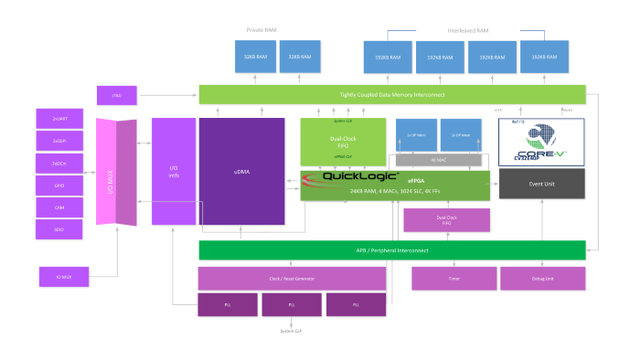

# CORE-V MCU SoC with Embedded eFPGA Technology
*QuickLogic Corporation*

One of the great attributes of open-source technology for developers is the ability to mix and match building blocks from different sources but with complementary features to create new platforms with amazing capabilities. A recent example started as a collaboration between ETH Zurich, one of the top technical universities in Europe, and QuickLogic to produce an SoC test chip we called the “Arnold.” The test chip paired ETHZ’s “PULPissimo” RISC-V core, now transferred to and updated by the OpenHW Group, and its associated subsystem with an embedded FPGA block from QuickLogic.

We are now taking this collaboration to the next level by building the CORE-V MCU chip, based on OpenHW Group’s fully verified CV32E40P core. The CV32E40P was released under OpenHW’s open-source process in December 2020, including full verification and update of the PULPissimo core based on contributions from many OpenHW members.

The CORE-V MCU project in turn integrates the CV32E40P core with the QuickLogic eFPGA within a 32-bit System on Chip architecture. It is supported by the CORE-V SDK and the suite of software tools developed by the OpenHW SW Task Group, while the eFPGA is supported by QuickLogic’s Aurora eFPGA user tools. Overall, the MCU is a multi-member open-source collaboration involving QuickLogic, CMC, Amazon, Ashling, Embecosm, and Imperas.

The features of the CORE-V MCU platform include not only the RISC-V core and eFPGA, but also 512KB of on-chip memory, a broad set of I/O peripherals with DMA support, and a shared memory accelerator interface.

The objective of our collaboration was to produce a high performance, low power MCU platform for AI/ML IoT application development. By combining the OpenHW CV32E40P open-source RISC-V core with embedded FPGA (eFPGA) technology, the provides an open-source MCU which allows developers to optimize the compute bandwidth / power curve for specific applications by making intelligent software (processor) / hardware (eFPGA) design allocations.

One specific example is running an AI-based application on the processor, but then offloading particular compute-intensive functions (such as feature extraction) onto the eFPGA block. Moving these functions to a hardware-based implementation can dramatically increase overall system performance while reducing power consumption. The embedded hardware-based DSP blocks and I/O interfaces in the eFPGA fabric further increase performance, help manage difficult timing requirements, and further reduce power consumption.

Because the RISC-V core is software-programmable and the embedded FPGA is user reconfigurable, the CORE-V MCU gives users a tremendous degree of flexibility to change their design at any phase of design development or deployment. This flexibility enables almost continuous design optimization for performance, power, and functionality as needs change, the competitive landscape shifts, or newer algorithms become available.

The CORE-V MCU SoC will be available from the OpenHW Group as part of a software and hardware development kit. To learn more about the CORE-V MCU DevKit, please visit [https://www.openhwgroup.org/core-v-devkits/](https://www.openhwgroup.org/core-v-devkits/)

